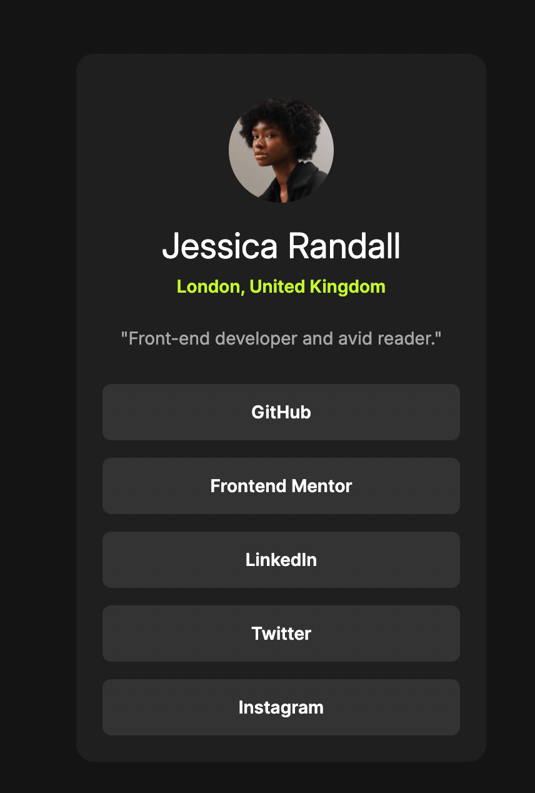

# social-links-profile
A social links profile built with HTML and CSS - part of the Frontend Mentor projects.

## Live Demo
[View Live](https://anjelotin.github.io/social-links-profile/)

## Technologies Used
- HTML
- CSS (Flexbox)
- Google Fonts [Inter](https://fonts.google.com/specimen/Inter)

## Screenshot

## What I learned 

During this project, I focused on:

- Structuring HTML using semantic elements like `<main>`, `<article>`, and `<section>`.
- Using CSS flexbox for layout.
- Organizing font size and spacing using `<--font->` and `<--space->` tokens.
- Adding hover animations and transitions to enhance visual and interactivity.